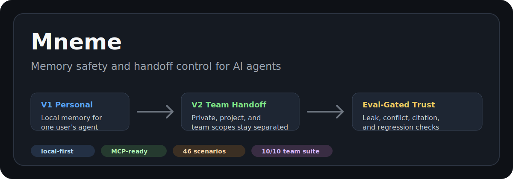
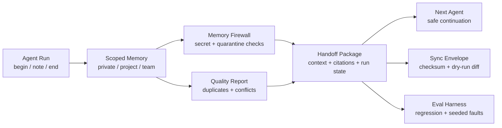

<p align="center">
  
</p>

<p align="center">
  <a href="https://github.com/Orvek-dev/Mneme/releases/tag/v0.64.0"></a>
  <a href="./LICENSE"></a>
  
  
  
  
</p>

<p align="center">
  <a href="#quickstart">Quickstart</a> ·
  <a href="#v1-vs-v2">V1 vs V2</a> ·
  <a href="#how-v2-works">How V2 Works</a> ·
  <a href="#evidence">Evidence</a> ·
  <a href="#docs">Docs</a>
</p>

# Mneme

Mneme is a local-first memory runtime and eval harness for AI agent workflows.
It is built for one practical problem: agents should remember useful work
context without leaking private, project-scoped, secret, or unreviewed memory.

```text
V1 = personal memory for one user's agent
V2 = team memory handoff with policy, firewall, quality, sync, and eval checks
```

Mneme is not a hosted vector database. The public repository focuses on
deterministic local behavior: JSON stores, CLI workflows, MCP-style adapters,
agent hooks, review tools, team handoff packages, and public-safe eval suites.
Hosted sync, dashboard, billing, and production storage belong to a separate
commercial track.

## At A Glance

| Surface | What it does | Start here |
| --- | --- | --- |
| `mneme-core` | v1 personal-memory engine and v2 team-memory policy core | [API contract](docs/project/api-contract.md) |
| `mneme-cli` | Local CLI over v1 and v2 JSON stores | [Local CLI](docs/v1/local-cli.md) |
| `mneme-eval` | Scenario-based eval harness with acceptance gates | [Eval Harness](docs/eval-harness/README.md) |
| V1 | Personal agent memory with citations, scope checks, review, curation, and repair | [V1 docs](docs/v1/README.md) |
| V2 | Team agent handoff with private/project/team scopes, firewall, quality, sync, and MCP bridge | [V2 docs](docs/v2/README.md) |
| Demo | Public-safe v2 team-agent workflow | [Team Agent Ops Example](examples/v2-team-agent-ops/README.md) |

## Quickstart

Run this from a fresh clone with Rust stable installed:

```sh
./scripts/install-local.sh
scripts/quickstart-smoke.sh
```

That smoke test creates a temporary local store, initializes Mneme, records a
preference, retrieves cited context, opens and closes an agent session, exports
a review artifact, and validates the store. It does not write private data to
the repository.

Run the complete V2 team-agent demo:

```sh
examples/v2-team-agent-ops/run-demo.sh
```

The demo generates a run-anchored handoff package, quality report, firewall
report, sync checksum dry-run, ontology projection, and public-safe readiness
summary.

## V1 vs V2

| Question | V1 Personal Memory | V2 Team Agent Memory |
| --- | --- | --- |
| Who is it for? | One user and their local agent | A team using multiple agents |
| Main job | Remember user/project preferences safely | Share only policy-allowed memory between agents |
| Memory scopes | User/project/local scopes | `private:<user>`, `project:<project>`, `agent-private:<agent>`, `team` |
| Handoff | Agent begin/end session context | Run begin/note/end plus handoff package |
| Safety | Secret blocking, scope filtering, citations | ACL, promotion review, quarantine, firewall, quality, sync checksum |
| Evaluation | Core/runtime/agent/dogfood/model suites | Team suite plus seeded leak and policy faults |

Use V1 when you want your own coding agent to remember you. Use V2 when a
planner, builder, reviewer, or other agents need to continue each other's work
without mixing private and team memory.

## How V2 Works



The strongest V2 use case is agent handoff:

```text
Agent A works in project scope
Agent A closes a run with notes and next steps
Mneme builds a handoff package
Private memory is redacted
Quarantined memory is omitted
Conflicting memory is surfaced
Sync checksum is verified
Agent B receives only allowed context
```

## Evidence

The latest public-safe local evidence snapshot was measured for `v0.64.0` on
2026-05-25. These numbers are reproducible development evidence for Mneme, not
claims against external production workloads.

| Evidence surface | Public-safe signal | Current result |
| --- | --- | --- |
| Public eval surface | Core, runtime, agent, dogfood, model, and team suites | `46` public scenarios |
| V1 ontology readiness | 13 golden ontology cases | `1.00` entity/relation/attribute F1 |
| V1 hard dogfood | 100 normal records, 150 adversarial records, 30 handoff workflows | `30/30` workflows passed |
| Safety guardrails | Scope leak and secret leak checks | `0` scope leaks, `0` secret leaks |
| V2 team readiness | ACL, promotion, revoke, secret, sync, firewall, handoff, run, quality, checksum, ontology | `10/10` team scenarios passed |
| V2 seeded faults | ACL bypass, secret leak, dropped citations, unapproved promotion, ignored revocation, quarantined leak | `6/6` detected |
| V2 dogfood shape | 120 synthetic team records, 80 adversarial records, 25 handoff workflows | fixture shape verified |

For a GitHub-native scorecard with reproducibility notes, see
[Mneme v1 Evidence Scorecard](docs/v1/evidence-scorecard.md). For V2 evidence,
see [V2 Evaluation](docs/v2/evaluation.md).

## Commands

```sh
# V1 local personal memory
mneme remember "user prefers local-first tools"
mneme context "local-first" --json
mneme begin "Draft setup plan" --query "local-first" --agent codex --json
mneme end session-001 --summary "Prepared setup plan" --json

# V2 team agent handoff
mneme team run begin "Atlas deploy handoff" \
  --actor bob --agent codex-bob \
  --query "rollback notes" \
  --scope project:atlas \
  --json
mneme team run end team-run-001 \
  --actor bob --agent codex-bob \
  --summary "Rollback notes reviewed" \
  --next "Run smoke test" \
  --json
mneme team run handoff team-run-001 --actor bob --agent codex-bob --json
mneme team quality --json
mneme team firewall --json
```

Without `--store`, V1 writes to `.mneme/mneme-v1.json` and V2 writes to
`.mneme/mneme-team-v2.json`. `.mneme/` is ignored by git.

## Repository Layout

```text
crates/mneme-core       shared v1 personal-memory and v2 team-memory core
crates/mneme-cli        local v1/v2 CLI
crates/mneme-eval       reusable eval harness CLI
docs/v1/                personal-memory docs
docs/v2/                team-memory, handoff, security, and eval docs
docs/eval-harness/      scenario, baseline, candidate, and provider eval docs
examples/v2-team-agent-ops/  public-safe v2 handoff demo
evals/                  public scenario fixtures
scripts/                quality, safety, MCP bridge, dogfood, and install helpers
spec/                   feature specs and verification maps
```

## Docs

- [Documentation Map](docs/README.md)
- [Mneme v1](docs/v1/README.md)
- [Mneme v2](docs/v2/README.md)
- [V2 Quickstart](docs/v2/quickstart.md)
- [V2 Team Agent Workflow](docs/v2/team-agent-workflow.md)
- [V2 Security Model](docs/v2/security-model.md)
- [V2 Evaluation](docs/v2/evaluation.md)
- [Eval Harness](docs/eval-harness/README.md)
- [Project and Release](docs/project/README.md)

<details>
<summary>Detailed evaluation and development commands</summary>

Validate and run the public core suite:

```sh
cargo run -p mneme-eval -- validate --suite core
cargo run -p mneme-eval -- run --suite core --target fake
cargo run -p mneme-eval -- run --suite core --target mneme-v1
```

Run the v2 team-memory readiness gate:

```sh
cargo run -p mneme-eval -- validate --suite team
cargo run -p mneme-eval -- run --suite team --target mneme-v2
cargo run -p mneme-eval -- acceptance --suite team --target mneme-v2
cargo run -p mneme-eval -- v2-readiness --json --report evals/reports/v2-readiness.json
scripts/v2-team-dogfood.py
```

Run model extraction in deterministic dry-run mode:

```sh
MNEME_OPENAI_DRY_RUN=1 cargo run -p mneme-eval -- run --suite model \
  --target mneme-v1-command \
  --extractor-command wrappers/openai_extractor.py
```

Before opening a PR:

```sh
./scripts/quality-gate.sh full
```

Check package and distribution guardrails directly:

```sh
./scripts/package-check.sh
./scripts/distribution-policy-check.sh
RUSTDOCFLAGS="-D warnings" cargo doc --workspace --no-deps
```

</details>

## Status

Mneme is pre-1.0. The useful surface today is local development and evaluation:

- local JSON stores with schema metadata, write locks, atomic writes, backups,
  import/export, repair, and restore;
- citation-first memory with source-event evidence;
- scope filtering before relevance ranking;
- secret-like data blocking before active context;
- agent begin/end hooks and stable JSON envelopes;
- review, quality, curation, compaction, and rollback tools;
- provider-neutral command extractor boundary;
- V2 users, agents, projects, scoped memory, promotion review, revoke, audit,
  quarantine, context packs, run handoff, sync, firewall, quality, ontology,
  and MCP-style stdio bridge;
- public-safe eval suites, dogfood scripts, candidate promotion, baseline
  comparison, seeded faults, and release quality gate.

Mneme is MIT licensed for source use. Workspace crates remain marked
`publish = false` until a registry publication path is intentionally prepared.
