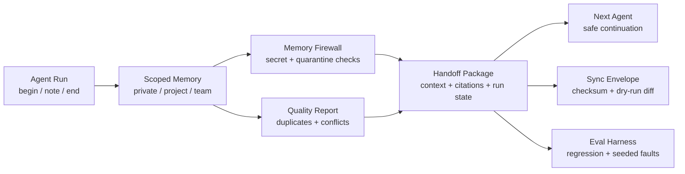

<p align="center">
  
</p>

<p align="center">
  <a href="https://github.com/Orvek-dev/Mneme/releases/tag/v1.0.0"></a>
  <a href="./LICENSE"></a>
  
  
  
  
  
</p>

<p align="center">
  <a href="#quickstart">Quickstart</a> ·
  <a href="#v1-vs-v2">V1 vs V2</a> ·
  <a href="#how-v2-works">How V2 Works</a> ·
  <a href="#v100-readiness">v1.0.0 Readiness</a> ·
  <a href="#evidence">Evidence</a> ·
  <a href="#docs">Docs</a>
</p>

# Mneme

Mneme is a local-first memory runtime and eval harness for AI agent workflows.
It is built for one practical problem: agents should remember useful work
context without leaking private, project-scoped, secret, or unreviewed memory.

```text
V1 = personal memory for one user's agent
V2 = team memory handoff with policy, firewall, quality, sync, and eval checks
```

Mneme is not a hosted vector database. The public repository focuses on
deterministic local behavior: JSON stores, CLI workflows, a local MCP server,
agent hooks, review tools, team handoff packages, and public-safe eval suites.
Hosted sync, dashboard, billing, and production storage belong to a separate
commercial track.

## At A Glance

| Surface | What it does | Start here |
| --- | --- | --- |
| `mneme-core` | v1 personal-memory engine and v2 team-memory policy core | [API contract](docs/project/api-contract.md) |
| `mneme-cli` | Local CLI over v1 and v2 JSON stores | [Local CLI](docs/v1/local-cli.md) |
| `mneme-mcp` | Local stdio MCP server for V1 personal memory and V2 team handoff tools | [MCP](docs/mcp.md), [crate README](crates/mneme-mcp/README.md) |
| `mneme-eval` | Scenario-based eval harness with acceptance gates | [Eval Harness](docs/eval-harness/README.md) |
| V1 | Personal agent memory with citations, scope checks, review, curation, and repair | [V1 docs](docs/v1/README.md) |
| V2 | Team agent handoff with private/project/team scopes, firewall, quality, sync, and MCP server | [V2 docs](docs/v2/README.md) |
| Demo | Public-safe v2 team-agent workflow | [Team Agent Ops Example](examples/v2-team-agent-ops/README.md) |

## Quickstart

Run this from a fresh clone with Rust stable installed:

```sh
./scripts/install-local.sh
scripts/quickstart-smoke.sh
```

That smoke test creates a temporary local store, initializes Mneme, records a
preference, retrieves cited context, opens and closes an agent session, exports
a review artifact, and validates the store. It does not write private data to
the repository.

Generate MCP config snippets for Codex, Claude Code, and Cursor:

```sh
cargo run -p mneme-mcp -- --self-test
cargo run -p mneme-cli -- mcp config --client all
cargo run -p mneme-eval -- run --suite mcp --target mneme-mcp
```

Run the complete V2 team-agent demo:

```sh
examples/v2-team-agent-ops/run-demo.sh
```

The demo generates a run-anchored handoff package, quality report, firewall
report, sync checksum dry-run, ontology projection, and public-safe readiness
summary.

## V1 vs V2

| Question | V1 Personal Memory | V2 Team Agent Memory |
| --- | --- | --- |
| Who is it for? | One user and their local agent | A team using multiple agents |
| Main job | Remember user/project preferences safely | Share only policy-allowed memory between agents |
| Memory scopes | User/project/local scopes | `private:<user>`, `project:<project>`, `agent-private:<agent>`, `team` |
| Handoff | Agent begin/end session context | Run begin/note/end plus handoff package |
| Safety | Secret blocking, scope filtering, citations | ACL, promotion review, quarantine, firewall, quality, sync checksum |
| Evaluation | Core/runtime/agent/dogfood/model suites | Team suite plus seeded leak and policy faults |

Use V1 when you want your own coding agent to remember you. Use V2 when a
planner, builder, reviewer, or other agents need to continue each other's work
without mixing private and team memory.

## How V2 Works



The strongest V2 use case is agent handoff:

```text
Agent A works in project scope
Agent A closes a run with notes and next steps
Mneme builds a handoff package
Private memory is redacted
Quarantined memory is omitted
Conflicting memory is surfaced
Sync checksum is verified
Agent B receives only allowed context
```

## Evidence

The latest public-safe local evidence snapshot was measured on 2026-05-30.
These numbers are reproducible development evidence for Mneme, not claims
against external production workloads. Raw dogfood logs, local client paths,
and real-session ledgers are intentionally kept out of git; the table below is
the reduced public-safe summary.

| Evidence surface | Public-safe signal | Current result |
| --- | --- | --- |
| Public eval surface | Core, runtime, agent, dogfood, model, team, MCP, and MCP agent-usability suites | `52` public scenarios |
| V1 ontology fixture regression | 14 committed ontology cases, including one paraphrase canary | committed fixture passes; not an open-domain ontology claim |
| V1 hard dogfood | 100 normal records, 150 adversarial records, 30 handoff workflows with non-exact retrieval queries | `30/30` workflows passed |
| V1 outcome gate | Acceptance template/validation, verifier hash/manifest trust, external verifier, judgment intake, gate_result storage, CLI/MCP workflow guard, failed-gate loop advice, Stop-hook block output, and non-zero failed gate path | MVP1/MVP2 smoke, verifier pinning, Stop-hook loop smoke, and MCP handoff guard passed locally |
| Safety guardrails | Pattern-based scope leak and synthetic secret leak checks | `0` scope leaks, `0` synthetic secret leaks |
| V2 team readiness | ACL, promotion, revoke, secret, sync, firewall, handoff, run, quality, checksum, ontology | `10/10` team scenarios passed |
| MCP readiness | V1/V2 tools through the local stdio server | `5/5` MCP scenarios passed |
| MCP agent usability | High-level task start/finish/handoff tools plus next-action checks | wrapper flow passed |
| MCP hard dogfood | V1 hard corpus, V1 ontology, V2 team corpus, team suite via MCP | passed locally |
| MCP seeded faults | V1 skip/leak/citation faults plus V2 policy/leak faults through MCP | `9/9` detected |
| MCP client smoke | Actual Codex, Claude Code, and Cursor CLI setup with isolated temporary stores | Registration, health, tool discovery, protocol continuity, and outcome-gated handoff guard passed |
| MCP V2 handoff dogfood | 30 local-only scripted handoff episodes across projects and reader agents | scripted loop passed; retrieval scores are local regression signals, not semantic-search benchmarks |
| MCP dogfood safety | Scope, secret-like, quarantined, and unauthorized-write probes in the local-only handoff loop | `0` scope leaks, `0` secret leaks, `0` quarantine leaks |
| Product validation loop | P1-P6 scripted artifact adoption, privacy/cost, lifecycle, ranking-decision, migration, review-schema, dogfood-bundle, held-out-claim, and scale checks | local loop passed; causal productivity, semantic search, open-domain extraction, and third-party value claims remain gated |
| Reduced real-session ledger | 3 public-safe development-session summaries, no raw transcript included | `3/3` scripted continuity checks passed with required citations |
| Local edge dogfood | Concurrent writes, concurrent handoffs, noisy scope retrieval, injection guard, restart guard | 80 V1 writers, 24 V2 handoffs, 300 noise records, and MCP restart guards passed |
| V2 seeded faults | ACL bypass, secret leak, dropped citations, unapproved promotion, ignored revocation, quarantined leak | `6/6` detected |
| V2 dogfood shape | 120 synthetic team records, 80 adversarial records, 25 handoff workflows | fixture shape verified |

For a GitHub-native scorecard with reproducibility notes, see
[Mneme v1 Evidence Scorecard](docs/v1/evidence-scorecard.md). For V2 evidence,
see [V2 Evaluation](docs/v2/evaluation.md).

Read these numbers as local regression and safety-boundary evidence. They do
not prove broad natural-language understanding, semantic search quality, or
third-party production performance. The ontology fixture is committed and
public-safe; the quality gate also runs `scripts/eval-integrity-check.py` so
golden input text cannot be copied into runtime source code.

The product validation loop is intentionally stricter about feature creep: P1
is scripted artifact adoption, not causal productivity evidence. LLM extraction
remains opt-in, provider use is budgeted and local-dry-run by default, semantic
retrieval is not shipped unless ranking evidence improves over term matching,
open-domain extraction claims require live-provider or independently reviewed
extractor evidence, storage changes must preserve legacy local stores, and
external value claims require a separate public-safe blind review artifact.

## v1.0.0 Readiness

v1.0.0 is the first public source release for Mneme's local agent-memory
runtime. The supported public surface is:

- local V1 personal memory through `mneme`;
- local V2 team handoff memory through `mneme team`;
- local stdio MCP for V1/V2 agent clients through `mneme-mcp`;
- outcome gates that turn "done" into stored verifier or reviewer evidence;
- public-safe eval, dogfood, package, install, and release quality gates.

This release does not claim hosted SaaS readiness, registry publication, broad
semantic search, open-domain natural-language extraction, causal productivity
improvement, or third-party production validation. Those claims remain blocked
until the corresponding external evidence exists.

The final readiness contract is documented in
[V1 Final Readiness](docs/project/v1-final-readiness.md) and enforced locally by
`scripts/v1-final-readiness-check.sh`, which is part of the full quality gate.

## Commands

```sh
# V1 local personal memory
mneme remember "user prefers local-first tools"
mneme context "local-first" --json
mneme begin "Draft setup plan" --query "local-first" --agent codex --json
mneme end session-001 --summary "Prepared setup plan" --json
mneme outcome template --kind rust --include-judgment --output acceptance.json
mneme outcome validate acceptance.json --json
mneme begin "Implement parser" --acceptance acceptance.json --json
mneme end session-002 --summary "Implemented parser" \
  --verifier-command scripts/mneme-outcome-verifier.py \
  --verifier-policy warn \
  --json
mneme outcome status session-002 --json

# V2 team agent handoff
mneme team run begin "Atlas deploy handoff" \
  --actor bob --agent codex-bob \
  --query "rollback notes" \
  --scope project:atlas \
  --json
mneme team run end team-run-001 \
  --actor bob --agent codex-bob \
  --summary "Rollback notes reviewed" \
  --next "Run smoke test" \
  --json
mneme team run handoff team-run-001 --actor bob --agent codex-bob --json
mneme team quality --json
mneme team firewall --json

# MCP config for agent clients
mneme mcp config --client all
scripts/mcp-client-continuity-smoke.py --require-clients

# V1 MCP continuity tools exposed to MCP clients:
# mneme_mcp_status
# mneme_agent_guide
# mneme_task_start
# mneme_task_finish
# mneme_prepare_handoff
# mneme_import_previous_context
```

Most agents should use the five high-level MCP tools first:
`mneme_mcp_status`, `mneme_agent_guide`, `mneme_task_start`,
`mneme_task_finish`, and `mneme_prepare_handoff`. The lower-level V1/V2 tools
remain available for advanced adapters and explicit policy workflows.
`mneme_task_start` can attach an outcome gate, `mneme_task_finish` can record
external verifier evidence, and `mneme_prepare_handoff` can report
`handoff_allowed=false` for a session whose gate did not complete.

Every context pack and handoff package is explicitly marked as partial context.
Mneme returns scoped, ranked memory with citations; it does not claim to be the
full conversation transcript. When you install Mneme after a long session, use
`mneme_import_previous_context` to import a public-safe summary and specific
memory notes into a lineage/scope without pretending the raw prior conversation
was captured.

Without `--store`, V1 writes to `.mneme/mneme-v1.json` and V2 writes to
`.mneme/mneme-team-v2.json`. `.mneme/` is ignored by git.

## Repository Layout

```text
crates/mneme-core       shared v1 personal-memory and v2 team-memory core
crates/mneme-cli        local v1/v2 CLI
crates/mneme-mcp        local stdio MCP server for V1 and V2 tools
crates/mneme-mcp/README.md  MCP server package guide
crates/mneme-eval       reusable eval harness CLI
docs/mcp.md             MCP server, client config, and eval quickstart
docs/v1/                personal-memory docs
docs/v2/                team-memory, handoff, security, and eval docs
docs/eval-harness/      scenario, baseline, candidate, and provider eval docs
examples/codex/         Codex MCP config and smoke-test notes
examples/claude-code/   Claude Code MCP config and continuity notes
examples/cursor/        Cursor MCP config and continuity notes
examples/mcp-client-smoke/  public-safe client smoke summary shape
examples/v2-team-agent-ops/  public-safe v2 handoff demo
evals/                  public scenario fixtures
scripts/                quality, safety, legacy bridge, dogfood, and install helpers
spec/                   feature specs and verification maps
```

## Docs

- [Documentation Map](docs/README.md)
- [Mneme v1](docs/v1/README.md)
- [V1 Outcome Gate](docs/v1/outcome-gate.md)
- [Mneme v2](docs/v2/README.md)
- [MCP](docs/mcp.md)
- [mneme-mcp crate README](crates/mneme-mcp/README.md)
- [Codex MCP Example](examples/codex/README.md)
- [V2 Quickstart](docs/v2/quickstart.md)
- [V2 Team Agent Workflow](docs/v2/team-agent-workflow.md)
- [V2 Security Model](docs/v2/security-model.md)
- [V2 Evaluation](docs/v2/evaluation.md)
- [Eval Harness](docs/eval-harness/README.md)
- [Project and Release](docs/project/README.md)

<details>
<summary>Detailed evaluation and development commands</summary>

Validate and run the public core suite:

```sh
cargo run -p mneme-eval -- validate --suite core
cargo run -p mneme-eval -- run --suite core --target fake
cargo run -p mneme-eval -- run --suite core --target mneme-v1
```

Run the v2 team-memory readiness gate:

```sh
cargo run -p mneme-eval -- validate --suite team
cargo run -p mneme-eval -- run --suite team --target mneme-v2
cargo run -p mneme-eval -- acceptance --suite team --target mneme-v2
cargo run -p mneme-eval -- v2-readiness --json --report evals/reports/v2-readiness.json
scripts/v2-team-dogfood.py
```

Run the MCP readiness gate:

```sh
cargo run -p mneme-mcp -- --self-test
cargo run -p mneme-eval -- validate --suite mcp
cargo run -p mneme-eval -- run --suite mcp --target mneme-mcp \
  --json \
  --report evals/reports/mcp-readiness.json
scripts/mcp-hard-dogfood.py --check-contract
scripts/mcp-hard-dogfood.py --check-dataset
scripts/mcp-hard-dogfood.py --check-seeded-faults
scripts/mcp-hard-dogfood.py --out-dir /tmp/mneme-mcp-hard-dogfood --force
```

Run model extraction in deterministic dry-run mode:

```sh
MNEME_OPENAI_DRY_RUN=1 cargo run -p mneme-eval -- run --suite model \
  --target mneme-v1-command \
  --extractor-command wrappers/openai_extractor.py
```

Before opening a PR:

```sh
./scripts/quality-gate.sh full
```

Check package and distribution guardrails directly:

```sh
./scripts/package-check.sh
./scripts/distribution-policy-check.sh
RUSTDOCFLAGS="-D warnings" cargo doc --workspace --no-deps
```

</details>

## Status

Mneme v1.0.0 is a public source release for local development and evaluation.
The supported surface today is:

- local JSON stores with schema metadata, write locks, atomic writes, backups,
  import/export, repair, and restore;
- citation-first memory with source-event evidence;
- scope filtering before relevance ranking;
- secret-like data blocking before active context;
- agent begin/end hooks and stable JSON envelopes;
- review, quality, curation, compaction, and rollback tools;
- provider-neutral command extractor boundary;
- V2 users, agents, projects, scoped memory, promotion review, revoke, audit,
  quarantine, context packs, run handoff, sync, firewall, quality, ontology,
  MCP server, and legacy MCP-style stdio bridge;
- public-safe eval suites, dogfood scripts, candidate promotion, baseline
  comparison, seeded faults, and release quality gate.

Mneme is MIT licensed for source use. Workspace crates remain marked
`publish = false` until a registry publication path is intentionally prepared.
