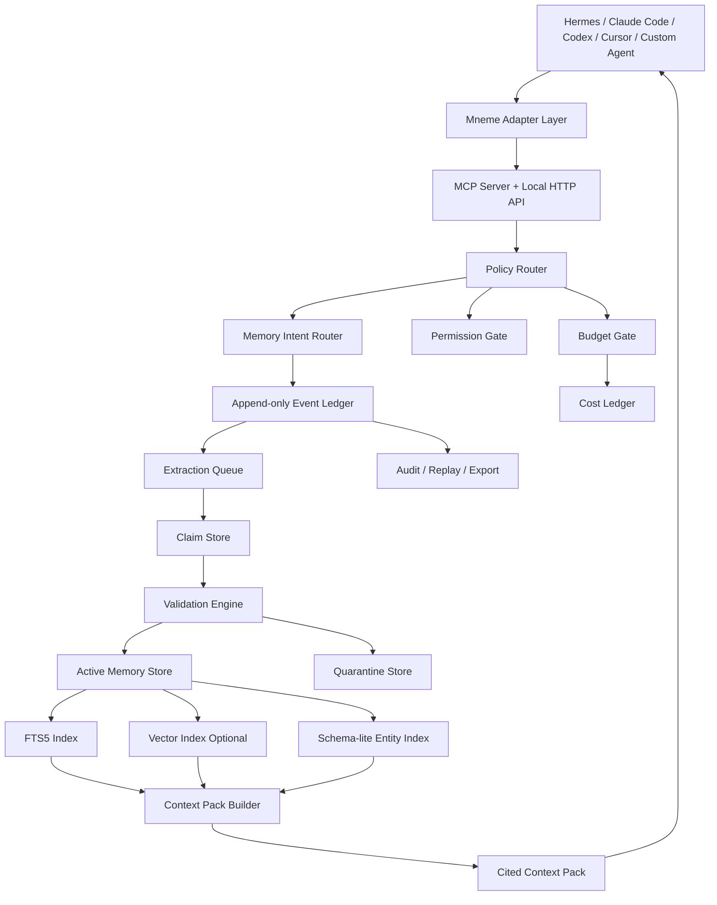

# Mneme PRD v1 Draft

**제품 정의:**  
Mneme는 1인 또는 팀이 여러 AI 에이전트를 운영할 때, 기억을 로컬 우선으로 저장·검증·조회·감사·통제하는 **Memory Control Plane / Memory Gateway**다.

**핵심 포지셔닝:**  
mem0보다 “더 똑똑한 기억 엔진”이 아니라, 여러 에이전트가 기억을 잘못 쓰거나, 비용을 폭주시거나, 출처를 섞거나, 오래 쓰며 멍청해지는 문제를 막는 **로컬-first 메모리 관제 계층**.

---

# 1. Executive Summary

## 1.1 문제

Hermes, Claude Code, Codex, Cursor, custom agent를 동시에 쓰는 사용자는 다음 문제를 겪는다.

| 문제 | 실제 고충 |
|---|---|
| 세션 단절 | 장기기억이 세션 변경 시 사라짐 |
| 도구 충돌 | Hermes 자체 `MEMORY.md` / `USER.md`와 외부 memory가 역할 충돌 |
| 비용 폭주 | Hindsight 등 세팅 오류로 수십~수백 달러 소진 가능 |
| attribution 혼입 | 누가 말했는지, 누구에 관한 내용인지 섞임 |
| 오래 쓰면 멍청해짐 | stale/noisy memory 누적 |
| 도구 두더지 게임 | Honcho, Hindsight, mem0, Supermemory, Alive 등을 계속 비교/교체 |
| 팀 공유 위험 | 개인 기억과 팀 지식 경계가 불명확 |
| agent가 memory를 안 씀 | MCP tool만 제공하면 agent가 호출하지 않을 수 있음 |

## 1.2 해결책

Mneme는 다음 4개를 강제한다.

1. **Observe every turn**  
   모든 대화와 agent event를 원문 event로 먼저 저장한다.

2. **Prepare cited context before response**  
   응답 전 필요한 기억만 citation 포함 context pack으로 구성한다.

3. **Enforce budget before every LLM call**  
   모든 extraction, summarization, retrieval-enhancement 호출 전에 token budget을 예약·차감한다.

4. **Audit every memory read/write**  
   어떤 기억이 왜 저장·조회·수정·삭제됐는지 추적한다.

## 1.3 제품 한 줄

> **Mneme is a local-first memory gateway for multi-agent users and teams. It controls what gets remembered, who can access it, why it was retrieved, and how much it costs.**

---

# 2. Target Users

## 2.1 Primary Target: 1인 + 다 AI 에이전트 Power User

대표 환경:

| 항목 | 예 |
|---|---|
| Main agent | Hermes Agent |
| Coding agents | Claude Code, Codex, Cursor |
| Memory tools | Honcho, Hindsight, mem0, Supermemory, Alive |
| 사용 방식 | 하루 수 시간 이상 agent와 작업 |
| 주요 관심 | 비용, 로컬, 장기기억, context 관리, 자동화 |

핵심 니즈:

| 니즈 | 설명 |
|---|---|
| 내 정보를 정확히 기억 | 선호, 프로젝트, 계정, 워크플로 |
| 여러 agent가 같은 기억 사용 | Hermes/Codex/Claude Code 간 기억 공유 |
| 비용 통제 | token runaway 차단 |
| 로컬-first | 회사 코드/개인정보 외부 전송 최소화 |
| 메모리 hygiene | 오래 쓸수록 멍청해지는 현상 방지 |

## 2.2 Secondary Target: 팀 + 다 AI 에이전트

대표 환경:

| 항목 | 예 |
|---|---|
| 팀 규모 | 3~50명 |
| agent | 개인별 Claude Code/Codex/Cursor + 팀 bot |
| 필요한 memory | 프로젝트 결정, 코드베이스 지식, 팀 규칙, 업무 맥락 |
| 위험 | 개인 기억이 팀에 섞임, 퇴사자 권한, audit 부재 |

팀용 핵심 니즈:

| 니즈 | 설명 |
|---|---|
| 개인/프로젝트/팀 scope 분리 | memory boundary |
| 팀 지식 승격 workflow | 개인 기억이 자동으로 팀 공유되지 않게 |
| ACL | agent/user별 read/write 권한 |
| 감사 | 누가 어떤 기억을 읽고 썼는지 |
| self-host | 보안/규제 대응 |

---

# 3. Competitive Positioning

## 3.1 mem0 대비 차별점

| 축 | mem0 | Mneme |
|---|---|---|
| 핵심 가치 | 범용 memory layer | multi-agent memory control plane |
| 강점 | benchmark, cross-LLM memory | 로컬 통제, attribution, budget, audit |
| local-first | 가능하나 managed 중심 성능 주장 | 기본값 local |
| agent isolation | metadata 중심 | agent/user/scope ACL 중심 |
| 비용 제어 | 사용자가 관리 | system-level hard cap |
| provenance | memory metadata | event-sourced audit chain |
| Hermes-native | 없음 | adapter 우선 |
| memory poisoning | 일반적 방어 필요 | memory firewall 제품 기능화 |

## 3.2 Honcho/Hindsight/Supermemory 대비

| 경쟁자 | 강점 | Mneme가 이길 지점 |
|---|---|---|
| Honcho | peer representation, reasoning memory | speaker/agent attribution 분리, local gateway |
| Hindsight | self-host, long-term memory 성능 | budget runaway 차단, gateway/hook |
| Supermemory | 강력한 API, connectors | local-first, audit, policy control |
| Claude memory | native UX | multi-agent 공유, scope, budget, audit |

## 3.3 피해야 할 포지셔닝

피해야 함:

> “mem0보다 정확한 memory engine”

권장:

> “여러 agent가 기억을 안전하게 공유하도록 통제하는 local memory gateway”

---

# 4. Product Principles

| 원칙 | 설명 |
|---|---|
| Local-first | 원문 event와 핵심 memory는 로컬에 저장 |
| Append-first | LLM extraction 전에 raw event를 먼저 저장 |
| Budget-before-call | 모든 LLM 호출 전 예산 예약 |
| Provenance-first | 모든 memory는 원문 event와 evidence span을 가진다 |
| Scope-first | 개인/프로젝트/팀/agent-private boundary 명확화 |
| Quarantine-by-default | 불확실하거나 untrusted source는 자동 주입 금지 |
| Correct-by-event | 수정은 overwrite가 아니라 correction event |
| Gateway-over-tool | MCP tool만 제공하지 않고 agent I/O 경로에 hook 제공 |
| Explainable retrieval | 왜 이 memory가 context에 들어갔는지 설명 가능해야 함 |

---

# 5. Core Product Concept

## 5.1 작동 모드

| 모드 | 설명 | v단계 |
|---|---|---|
| Observe mode | 대화를 저장만 함 | v1 |
| Assist mode | agent가 요청하면 memory 검색 | v1 |
| Gateway mode | 응답 전 Mneme가 context pack 생성 | v1 |
| Enforce mode | policy/budget/ACL 위반 시 차단 | v1.5 |
| Team mode | 개인/프로젝트/팀 memory 분리 | v2 |

## 5.2 기본 플로우

```text
Agent/User message
→ Mneme observe hook
→ raw event append
→ policy check
→ explicit memory immediate extraction
→ background claim extraction
→ validation/quarantine
→ context request
→ scope filter
→ retrieval
→ context pack with citations
→ agent response
→ feedback / audit event
```

---

# 6. Architecture



---

# 7. Data Model

## 7.1 Event

원문 보존 단위.

```ts
type Event = {
  id: string
  timestamp: string

  source: "hermes" | "claude_code" | "codex" | "cursor" | "api" | "import"
  conversation_id: string
  message_id?: string

  speaker_id: string
  actor_agent_id?: string
  observed_by_agent_id?: string

  text: string
  text_hash: string

  visibility: "private" | "project" | "team" | "agent_private"
  trust_level: "trusted_user" | "agent" | "web" | "imported" | "untrusted"

  created_by: string
  schema_version: string
}
```

## 7.2 Claim

추출된 기억 후보.

```ts
type Claim = {
  id: string

  subject: string
  predicate: string
  object: unknown
  qualifiers?: Record<string, unknown>

  evidence_event_ids: string[]
  evidence_spans: Array<{
    event_id: string
    start: number
    end: number
  }>

  speaker_id: string
  reported_by?: string
  attributed_to?: string
  extracted_by_agent_id: string
  extraction_model?: string

  confidence: number
  attribution_confidence: number
  freshness_score: number

  scope: "private" | "project" | "team" | "agent_private"

  status:
    | "proposed"
    | "active"
    | "pinned"
    | "stale"
    | "superseded"
    | "disputed"
    | "quarantined"
    | "blocked_secret"
    | "deleted_tombstone"
    | "purged"

  valid_from?: string
  valid_until?: string
  superseded_by?: string
}
```

## 7.3 Context Pack

agent에게 주입되는 최종 기억 단위.

```ts
type ContextPack = {
  id: string
  target_agent_id: string
  query: string

  token_budget: number
  estimated_tokens: number

  items: Array<{
    claim_id: string
    claim_text: string
    confidence: number
    freshness_score: number
    scope: string
    why_included: string
    source_event_ids: string[]
    conflict_warning?: string
  }>

  omitted: Array<{
    reason: "budget" | "permission" | "low_confidence" | "quarantine" | "stale"
    claim_id?: string
  }>
}
```

---

# 8. Storage Design

## 8.1 v1 Storage

| 계층 | 기술 |
|---|---|
| Event ledger | SQLite WAL |
| Claim store | SQLite |
| Keyword search | SQLite FTS5 |
| Vector search | sqlite-vec optional |
| Entity/schema-lite | SQLite tables |
| Archive | zstd compressed snapshots |
| Secret blocklist | local encrypted config |
| Audit | append-only event table |

필수 제약:

| 제약 | 이유 |
|---|---|
| single-writer queue | SQLite WAL도 writer는 기본 하나 |
| event-first write | extraction 실패해도 원문 보존 |
| index rebuild 가능 | FTS/vector는 materialized view |
| WAL checkpoint policy | 장기 실행 reader로 WAL 비대화 방지 |
| migration rollback | schema 변경 실패 대응 |

## 8.2 v2 Storage

| 계층 | 기술 |
|---|---|
| Team server | self-hosted service |
| Team DB | Postgres + pgvector 또는 replicated SQLite |
| Sync | event replay + conflict policy |
| Admin audit | immutable audit log |
| Enterprise encryption | KMS / BYOK optional |

---

# 9. Memory Policy

## 9.1 Write Policy

| 입력 | 기본 처리 |
|---|---|
| “기억해줘” | 즉시 active claim |
| 명시적 선호 | active 또는 proposed |
| 프로젝트 결정 | project candidate |
| 팀 결정 | team candidate, 승인 필요 |
| API key/secret | blocked_secret |
| 웹 문서 instruction | quarantined |
| agent 자기 반성 | agent_private |
| 사용자에 대한 추론 | proposed/quarantine |
| 모순되는 기억 | disputed 또는 superseded |

## 9.2 Read Policy

| Scope | 읽기 가능 |
|---|---|
| private | 사용자 본인 + 승인된 agent |
| project | 프로젝트 권한 agent/user |
| team | 팀 workspace 권한자 |
| agent_private | 해당 agent만 |
| quarantine | context pack 자동 주입 금지 |
| blocked_secret | retrieval 금지 |
| deleted_tombstone | retrieval 금지, 재생성 방지 |

---

# 10. API / MCP

## 10.1 MCP Tools

| Tool | 목적 |
|---|---|
| `memory_append_event` | 원문 event 저장 |
| `memory_context_pack` | 응답 전 context pack 생성 |
| `memory_query` | 일반 검색 |
| `memory_propose_claims` | claim 후보 추출 |
| `memory_confirm_claim` | 사용자 확인 후 active 전환 |
| `memory_correct` | correction/supersede event 생성 |
| `memory_forget` | tombstone 또는 purge |
| `memory_explain` | 왜 이 memory가 쓰였는지 설명 |
| `memory_feedback` | helpful/irrelevant/wrong 피드백 |
| `memory_budget_status` | 예산 확인 |
| `memory_agent_register` | agent 등록 |
| `memory_scope_grant` | 권한 부여 |
| `memory_audit` | provenance chain 조회 |
| `memory_doctor` | memory 품질 진단 |

## 10.2 HTTP API

```http
POST /v1/events
POST /v1/context-pack
GET  /v1/search
GET  /v1/memories/{id}
POST /v1/memories/{id}/confirm
POST /v1/memories/{id}/correct
DELETE /v1/memories/{id}
GET  /v1/audit/{id}
GET  /v1/budget
POST /v1/agents/register
GET  /v1/agents
POST /v1/scopes/grant
GET  /v1/doctor
```

---

# 11. Budget System

## 11.1 원칙

budget dashboard가 아니라 **pre-call hard gate**여야 한다.

```text
estimate tokens
→ reserve budget
→ call model
→ reconcile actual usage
→ refund or finalize
```

## 11.2 예산 종류

| 예산 | 목적 |
|---|---|
| daily cloud token cap | 하루 폭주 방지 |
| monthly cloud token cap | 과금 상한 |
| per-agent cap | 특정 agent runaway 방지 |
| per-operation cap | extraction/summary loop 차단 |
| per-context-pack cap | context 과주입 방지 |
| local compute cap | local LLM 과도 사용 방지 |

## 11.3 초과 시 graceful degradation

| 상황 | 처리 |
|---|---|
| extraction budget 초과 | explicit remember만 rule-based 처리 |
| retrieval budget 초과 | FTS/entity search만 사용 |
| context budget 초과 | pinned + high-confidence memory만 |
| monthly cap 초과 | cloud LLM 금지, local/rule fallback |

---

# 12. Security / Privacy

## 12.1 Memory Firewall

차단/격리 대상:

| 위험 | 대응 |
|---|---|
| prompt injection | instruction stripping + quarantine |
| secret 저장 | detector + blocked_secret |
| identity override | admin/user identity claim 차단 |
| false preference poisoning | low-trust source quarantine |
| tool misuse memory | dangerous instruction block |
| cross-agent leakage | ACL + scope filter |
| local HTTP abuse | bearer token / Unix socket / CORS deny |
| MCP tool abuse | capability token |

## 12.2 Local API 보안

v1 필수:

| 항목 | 기본값 |
|---|---|
| bind | `127.0.0.1` 또는 Unix socket |
| auth | local bearer token |
| CORS | deny by default |
| audit | every read/write |
| secret redaction | enabled |
| external telemetry | disabled |

---

# 13. Edge Cases

| Edge case | 대응 |
|---|---|
| LLM extraction 실패 | raw event는 이미 저장, claim pending |
| 같은 턴 recall 필요 | write-through hot cache |
| agent가 memory tool 미호출 | gateway hook |
| budget 폭주 | token escrow |
| API key 저장 | blocked_secret |
| 인용/전언 | `reported_by`, `attributed_to` 분리 |
| agent가 자기 말을 사용자 말로 저장 | `speaker_id`, `actor_agent_id` 분리 |
| 오래된 선호 | stale/superseded lifecycle |
| 사용자 정정 | correction event |
| 팀 공유 누출 | promotion workflow |
| vector false positive | FTS/entity/time rank fusion |
| SQLite busy | single-writer queue |
| 디스크 full | preflight + emergency compaction |
| 모델 변경 drift | extractor versioning |
| 삭제 후 재생성 | deleted tombstone |
| Hermes MEMORY.md 비대화 | Mneme context pack만 startup 주입 |

---

# 14. Roadmap

## Phase 0: Foundation / Eval Harness

목표: build 전 검증 가능한 기준 확립.

기간: 2~4주

포함:

| 항목 | 설명 |
|---|---|
| Synthetic eval set | attribution, recall, poisoning, stale memory |
| Real-world eval seed | 카카오톡 기반 anonymized scenario |
| SQLite schema | event, claim, audit, budget |
| CLI skeleton | `mneme init`, `status`, `doctor` |
| budget ledger prototype | token reservation/reconciliation |
| context pack format | cited context schema |
| adapter spike | Hermes hook 가능성 검증 |

완료 기준:

| 지표 | 목표 |
|---|---|
| same-turn recall test | pass |
| budget runaway test | cap violation 0 |
| attribution synthetic F1 | baseline 측정 |
| raw event append | crash-safe prototype |

---

## Phase 1: v1 Local Memory Gateway

목표: 1인 + 다 AI 에이전트 사용자가 실제로 쓸 수 있는 로컬 memory gateway.

기간: 8~12주

포함:

| 기능 | 설명 |
|---|---|
| local SQLite event ledger | source of truth |
| MCP stdio server | Claude Code/Codex/Hermes 연결 |
| local HTTP API | custom agent 연결 |
| Hermes adapter | observe/context hook |
| agent registry | agent id, capability 관리 |
| explicit remember extraction | rule-based immediate claim |
| LLM extraction | budget-bound background extraction |
| FTS5 retrieval | 기본 검색 |
| vector retrieval | optional |
| context pack builder | citation, why_included 포함 |
| budget hard cap | pre-call token escrow |
| audit CLI | memory provenance 조회 |
| correction/forget | tombstone/supersede |
| secret detector | blocked_secret |
| memory doctor basic | stale/duplicate/context bloat 진단 |

v1 Non-goals:

| 제외 | 이유 |
|---|---|
| team sync | scope 과대 |
| full web UI | CLI/TUI 우선 |
| adaptive learning | 디버깅 난이도 |
| full ontology | schema-lite 우선 |
| 모든 tool migration | Hermes/Codex/Claude 우선 |
| 정확도 최고 주장 | eval 전 금지 |

v1 성공 지표:

| 지표 | 목표 |
|---|---|
| raw event loss under API/LLM failure | 0 |
| budget hard-cap violation | 0 |
| explicit remember same-turn recall | 100% |
| context pack citation coverage | 100% |
| synthetic attribution F1 | ≥ 0.98 |
| p95 query latency at 5k memories | < 100ms |
| startup context overhead | < 1,500 tokens |
| secret leakage into active memory | 0 |
| design partner day-30 active use | > 50% |

---

## Phase 1.5: Hygiene / Control / Integrations

목표: 오래 쓸수록 멍청해지는 문제와 도구 두더지 게임 해결.

기간: 6~8주

포함:

| 기능 | 설명 |
|---|---|
| memory diff | 주간 추가/수정/삭제/충돌 요약 |
| advanced doctor | stale, duplicate, noisy memory 분석 |
| contradiction detection | basic semantic + schema conflict |
| quarantine review CLI/TUI | 후보 승인/삭제 |
| context quality scoring | 불필요 memory 주입 감지 |
| Enforce mode | policy 위반 차단 |
| backend adapters | mem0/Hindsight/Honcho/Supermemory optional |
| import/export | JSONL, Markdown, tool-specific import |
| MEMORY.md bridge | Hermes local files와 충돌 방지 |
| agent feedback loop | helpful/irrelevant/wrong 반영 |

성공 지표:

| 지표 | 목표 |
|---|---|
| stale memory context 비중 | doctor에서 측정 및 감소 |
| irrelevant context pack item rate | < 10% |
| correction reflected next retrieval | 100% |
| quarantine false promotion | < 5% synthetic |
| migration success | Honcho/Hermes memory import basic |

---

## Phase 2: Team Memory Control Plane

목표: 팀 + 다 AI 에이전트 환경에서 개인/프로젝트/팀 memory를 안전하게 운영.

기간: 12~16주

포함:

| 기능 | 설명 |
|---|---|
| workspace model | user, project, team |
| team sync server | self-hosted |
| ACL | user/agent/scope read/write 권한 |
| team promotion workflow | 개인 memory → 팀 memory 승인 |
| project memory | repo/project 단위 context |
| admin audit | read/write/export log |
| offboarding | 퇴사자 access revoke |
| team context pack | 팀 정책 포함 |
| policy templates | engineering, design, sales 등 |
| Docker deployment | team self-host |

v2 Non-goals:

| 제외 | 이유 |
|---|---|
| enterprise compliance full package | v3 |
| SSO 전면 지원 | v3 |
| managed cloud | 별도 사업 결정 필요 |

v2 성공 지표:

| 지표 | 목표 |
|---|---|
| personal memory team leakage | 0 in test suite |
| team promotion audit coverage | 100% |
| ACL bypass | 0 |
| team context pack citation coverage | 100% |
| project onboarding time reduction | design partner 측정 |

---

## Phase 3: Enterprise / Governance

목표: 규제 산업 또는 보안 민감 조직에서 운영 가능한 enterprise memory layer.

포함:

| 기능 | 설명 |
|---|---|
| SSO/SAML/OIDC | 기업 인증 |
| RBAC/ABAC | 세밀 권한 |
| compliance export | audit API |
| retention policy | 법무/보안 정책 |
| BYOK/KMS | 키 관리 |
| air-gapped deployment | 폐쇄망 |
| admin web console | governance UI |
| policy-as-code | memory write/read 정책 코드화 |
| DLP integration | secret/PII 고도화 |
| SOC2 prep | 운영 통제 |

---

# 15. MVP Cutline

## 반드시 있어야 함

| 기능 | 이유 |
|---|---|
| event-first storage | 데이터 손실 방지 |
| explicit remember same-turn recall | UX 핵심 |
| MCP + HTTP | agent 연결성 |
| context pack citation | 신뢰 |
| budget escrow | 비용 폭주 방지 |
| speaker/agent attribution | Honcho류 pain 해결 |
| local-first single binary | adoption |
| secret blocking | 보안 |
| audit CLI | power user 신뢰 |

## 없어도 됨

| 기능 | 이유 |
|---|---|
| fancy UI | CLI 사용자 타겟 |
| full graph ontology | v1 과대 |
| adaptive ML | 디버깅 어려움 |
| CRDT sync | v2 |
| 모든 memory tool 대체 | control plane으로 우회 가능 |
| 완전 자동 contradiction resolution | 위험 |

---

# 16. Open Questions

| 질문 | 결정 시점 |
|---|---|
| OSS 여부 | Phase 0 종료 전 |
| 제품명 Mneme 유지 여부 | design partner 인터뷰 후 |
| Hermes adapter를 어느 수준까지 강제할지 | v1 설계 전 |
| vector backend 기본값 | Phase 0 benchmark 후 |
| local LLM 기본 모델 | Phase 0 benchmark 후 |
| team sync 구현 방식 | v2 착수 전 |
| managed cloud 제공 여부 | v2 이후 |

---

# 17. 최종 제품 문장

## 짧은 버전

> Mneme는 여러 AI 에이전트가 공유하는 기억을 로컬에서 안전하게 통제하는 memory gateway다.

## 긴 버전

> Mneme is a local-first memory control plane for individuals and teams running multiple AI agents. It observes every turn, stores raw events safely, extracts memories under a hard budget, separates speaker and agent attribution, builds cited context packs, and audits every read/write so agents can remember without leaking, drifting, or overspending.

## 한국어 마케팅 문장

> 여러 AI 에이전트를 오래 쓰다 보면 기억은 쌓이지만, 비용은 터지고, 출처는 섞이고, context는 무거워집니다. Mneme는 기억을 더 많이 저장하는 도구가 아니라, 무엇을 기억하고 누가 쓰며 왜 불러왔는지 통제하는 로컬-first 메모리 게이트웨이입니다.
