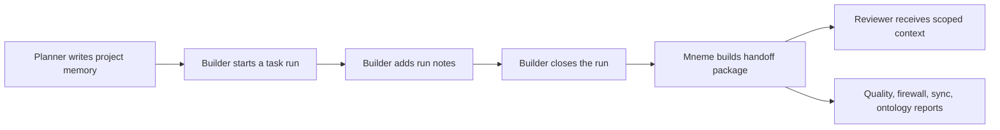

# Team Agent Workflow

Mneme v2 is designed around a simple team-agent loop:



The important point is not that one more JSON file exists. The important point
is that each agent handoff is backed by policy checks and evidence.

## Roles

Use a small role model:

- `admin`: can create and revoke team-level authority.
- `maintainer`: can review promotions and participate in project work.
- `member`: can write scoped memory and request handoff packages.

Agents are owned by users. If a user or agent is revoked, that agent should no
longer read or write team memory.

## Scopes

Use scopes as the first line of defense:

- `team`: reviewed memory meant for everyone in the workspace.
- `project:<project>`: shared only with project members.
- `private:<user>`: visible only to that user.
- `agent-private:<agent>`: visible only to that agent.

Relevance ranking happens after scope filtering. This keeps private or
quarantined memory out of context even if the query matches it well.

## Task Runs

A run is the durable work unit:

```sh
mneme team run begin "Atlas release handoff" \
  --actor bob \
  --agent builder-bob \
  --query "rollback notes" \
  --scope project:atlas \
  --json

mneme team run note team-run-001 "Atlas smoke test must run after deploy" \
  --actor bob \
  --agent builder-bob \
  --scope project:atlas \
  --json

mneme team run end team-run-001 \
  --actor bob \
  --agent builder-bob \
  --summary "Rollback notes and smoke test owner confirmed" \
  --next "Run smoke test after deploy" \
  --json
```

The run stores:

- task name;
- actor user and agent;
- scope;
- starting context query;
- memory IDs used at the start;
- memory IDs written during the run;
- close summary;
- next steps.

## Handoff Package

The handoff package is the object another agent can consume:

```sh
mneme team run handoff team-run-001 \
  --actor bob \
  --agent builder-bob \
  --json
```

It contains:

- actor identity;
- run record;
- scoped context pack with citations;
- omitted records with redacted text;
- sync envelope that excludes private, agent-private, blocked, and quarantined
  memory;
- memory firewall report;
- quality report;
- actor-scoped ontology projection.

## Promotion Review

Promotion is how memory moves from local scope to team scope:

```sh
mneme team promote team-memory-001 --actor bob --agent builder-bob --json
mneme team promotion report team-promotion-001 --json
mneme team review team-promotion-001 --actor alice --approve --json
```

Promotion is intentionally reviewed. A member can propose; an admin or
maintainer approves. This keeps accidental private notes from becoming team
knowledge.

## Operating Rule

Use this rule when integrating v2 into agents:

```text
Read context before work.
Write only scoped memory during work.
Close the run with summary and next steps.
Handoff only through Mneme's package.
Treat quality/firewall/sync failures as review blockers.
```
