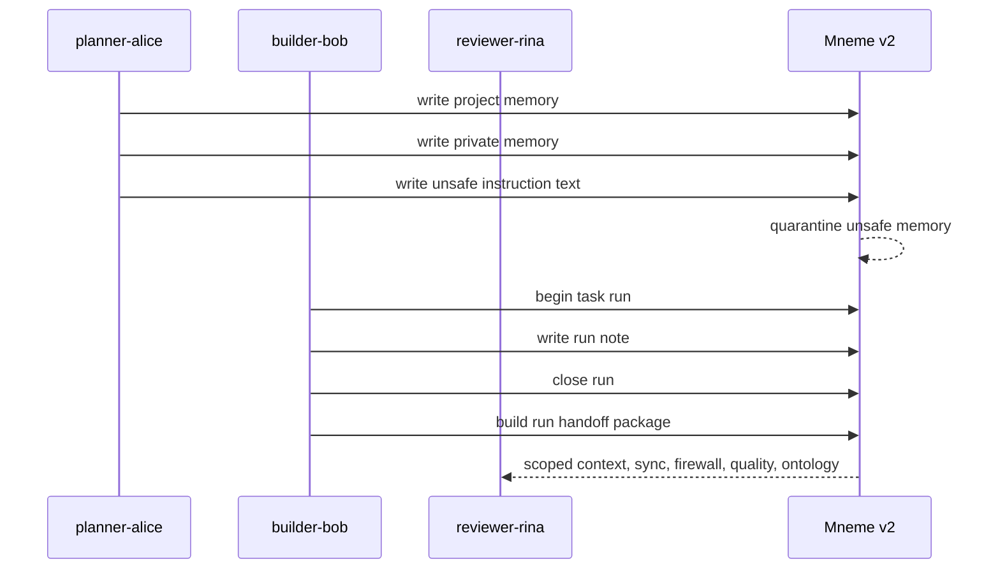

# V2 Team Agent Ops Example

This example is a public-safe team-agent workflow for Mneme v2. It shows how a
planner, builder, and reviewer can share project memory through scoped context
and run handoff packages without exposing private or quarantined memory.

Run it from the repository root:

```sh
examples/v2-team-agent-ops/run-demo.sh
```

Or choose the output directory:

```sh
examples/v2-team-agent-ops/run-demo.sh --out-dir /tmp/mneme-v2-team-agent-ops
```

The demo writes:

- `store/team.json`: isolated local v2 store;
- `reports/run-begin.json`: starting context for the builder;
- `reports/run-handoff.json`: complete run-anchored handoff package;
- `reports/handoff-summary.json`: stable summary of the handoff checks;
- `reports/quality.json`: duplicate/conflict/run-state report;
- `reports/firewall.json`: quarantine and high-risk memory report;
- `reports/sync-import-dry-run.json`: checksum and diff report;
- `reports/readiness.md`: human-readable result summary.

The committed files in `reports/` are static public-safe examples. Re-run the
script to generate fresh local artifacts.

## Scenario



## What To Check

The demo is successful when:

- project memory is present in `context_pack.items`;
- private memory appears only as redacted omitted metadata;
- quarantined memory is omitted from context and sync;
- `sync_import.report.checksum_verified` is `true`;
- `quality.conflict_group_count` is at least `1`;
- `firewall.high_count` is `0`;
- a non-project user receives no project context.

## Agent Integration

See [mcp-agent-config.example.json](mcp-agent-config.example.json) for a
minimal MCP-style local stdio configuration. It intentionally contains no API
keys, tokens, or personal paths.
